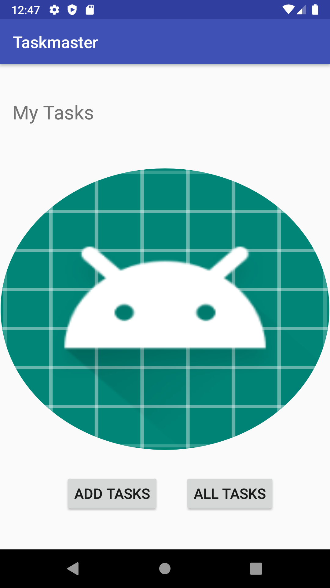
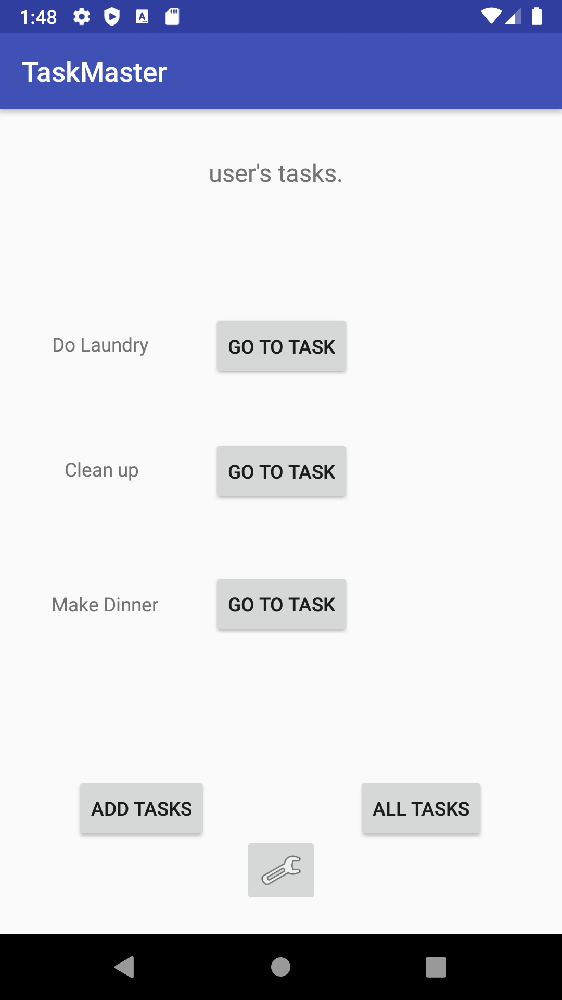

#  TaskMaster 
<!-- Short summary or background information -->
Start building an Android app that will be a main focus of the second half of the course: TaskMaster.
## Challenge Description
<!-- Description of the challenge -->
Create a new directory and repo to hold this app. Name it taskmaster. Within that directory, use Android Studio to set up a new app, as discussed in class
#### 11FEB2020
<!-- What approach did you take? Why? What is the Big O space/time for this approach? -->

- Created pages for home page, AllTasks, and Add a Task.  
- Created routing to secondary pages from home screen(currently only way back to home is phone's back button)
- Add task page should allow user to add task and see confirmation by 'SUBMITTED!!!' displayed on screen
- AllTasks should show list of all tasks
 
##### Image

#  TaskMaster 
<!-- Short summary or background information -->
Start building an Android app that will be a main focus of the second half of the course: TaskMaster.
## Challenge Description
<!-- Description of the challenge -->
Create a Task class. A Task should have a title, a body, and a state. The state should be one of “new”, “assigned”, “in progress”, or “complete”.
#### 19FEB2020
<!-- What approach did you take? Why? What is the Big O space/time for this approach? -->

Instituted the recycle view to populate tasks 

 

#### Image

#  TaskMaster 
<!-- Short summary or background information -->
Start building an Android app that will be a main focus of the second half of the course: TaskMaster.
## Challenge Description
<!-- Description of the challenge -->
Refactor your model layer to store Task data in a local database.#### 13FEB2020
<!-- What approach did you take? Why? What is the Big O space/time for this approach? -->

Connected to database and ran first test through espresso using emulator..
TODO: Run espresso without emulator

 

#### Image

#  TaskMaster 
<!-- Short summary or background information -->
Initialized Cognito and enabled login.  Also got S3 enabled
## Challenge Description
<!-- Description of the challenge -->
Refactor your model layer to store Task data in a local database.

<!-- What approach did you take? Why? What is the Big O space/time for this approach? -->

 

#### Image

## Taskmaster

### 20 Feb 2020

- Add RecyclerView to All Task Activity to display all tasks from DB. When clicked on a toast appears with details on the task.

 

#### Image

## Taskmaster

### 27 Feb 2020

  -  User can upload task image to S3 and display on the task detail page.

 

#### Image

## Taskmaster

### 03 Mar 2020

 - working on push notifications

